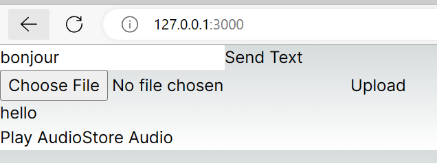

# Summary

As a language learner, you might want to make your own flash card for memorization. Anki is a widely used tool to help you learn new words.

This project is to generate anki flash cards based upon a csv file composed of words/phrases/sentences to learn. You can input a csv file with the words/phrases/sentences you want to learn,
and the generated anki flash cards file contains the translation as well as the pronunciation of the words/phrases/sentences. The file can be imported into anki App.

It contains the following three parts:

- A flask web app that handles http request to translate and pronounce a single word/phrase/sentence or to generate the anki flash cards file with a given csv file.
- A react app that takes a single word/phrase/sentence or a csv file to send to the flask web app.
- A standalone Python script that loads a cvs file and generate anki flash cards file.

The project majorly utilized:

- LibreTranslate: https://github.com/LibreTranslate/LibreTranslate for translation
- OpenTTS: https://github.com/synesthesiam/opentts for pronunciation
- Anki: https://github.com/ankitects/anki for anki flash card generation

## Requirement

- Python >= 3.9
- Docker

Optionally to run the web app, Node.js is required. The version I used for dev is v16.14.2

## Quick Start

**The language settings in the project are fixed to translating French to English and pronouncing French, if you want to translate and pronounce other languags, please update the code according to OpenTTS and LibreTranslate projects.**

## Set up the pronunciation service

```bash
docker run -it -p 5500:5500 synesthesiam/opentts:<LANGUAGE>
```

For example, to learn French, set `<LANGUAGE>` to `fr`:
```bash
docker run -it --detach -p 5500:5500 synesthesiam/opentts:fr
```

By default, it listens on `http://127.0.0.1:5500`, check [OpenTTS](https://github.com/synesthesiam/opentts) for advanced usage.

## Set up the translation service

```bash
python3.9 -m venv translation_venv
source translation_venv/bin/activate
pip install libretranslate
libretranslate
```

By default, it listens on `http://127.0.0.1:5000`, check [LibreTranslate](LibreTranslate) for advanced usage.

## Run the standalone Python script

> You are free to reuse the python virtual env created for the translation service or create a new one.

```bash
pip install anki
python backend/standalone_app.py --output_dir <OUTPUT_DIR> --input_cvs_file <INPUT_CSV_FILE>

# example
# python backend/standalone_app.py --output_dir ~/ --input_cvs_file ~/test.csv
```

> If there's any package missing, you can `pip install -r requirement.txt`, the `requirement.txt` is hosted in the `backend` dir

## Run the Flask web app and React app

### Run the Flask web app

> You are free to reuse the python virtual env created for the translation service or create a new one.

```bash
pip install flask
python backend/app.py
```

By default the flask app listens on `http://127.0.0.1:5123`.

### Run the React app

```bash
cd frontend
npm init --yes
npm install
npm run dev
```

By default the React app runs on `http://127.0.0.1:3000/`

#### Demo

- To translate a single word/phrase/sentence, type your input in the text editor and click `Send Text`, you will be able to see the translation under `Choose File` button and can play or download the audio file.
- To generated anki flash card, click `Choose File` to select your `csv` file and then click `Upload`, after server processing the file and response, React app will prompt you to download the file.  You can find a `sample.csv` file in the root dir.




## Known limitation/issues

- There's a `tmpdir`` in the `backend`` dir which are used to stored generated audio file. Clean it up if you don't want to keep them.
